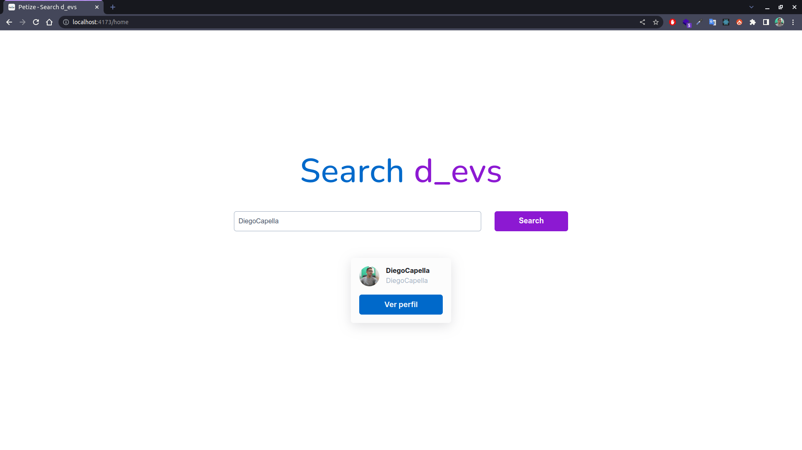
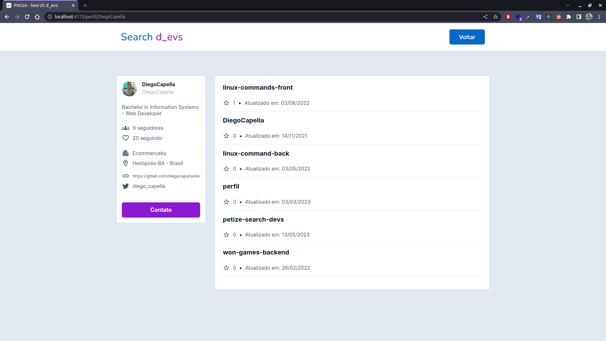

# Started
- É necessário ter o `node` instalado na máquina

## Dev
- Instale as dependências com: `yarn install` ou `npm install`. 
  - OBS. Utilizei o `yarn`
- Ambiente de desenvolvimento
  - Inicie o projeto com: `yarn dev` ou `npm run dev`
- Acesse em: http://localhost:3000

## Prod
- Execute  `yarn build` ou `npm run build` para fazer o build do projeto
- Execute  `yarn preview` ou `npm run preview` para ver como o projeto funcionara em produção
- Para mais informações do deploy, ver a documentação do [Vite](https://vitejs.dev/guide/static-deploy.html)

## libs e frameworks
- Vite: Por se tratar de um projeto "simple" sem a necessidade de muitos recursos optei pelo Vite
- Material UI / Icons: utilizei alguns componentes do mesmo com requisito solicitado, porém tenho pouca prática
- Styled-components: Tenho mais prática com o mesmo, pos isso optei por utilizar também

## Preview

